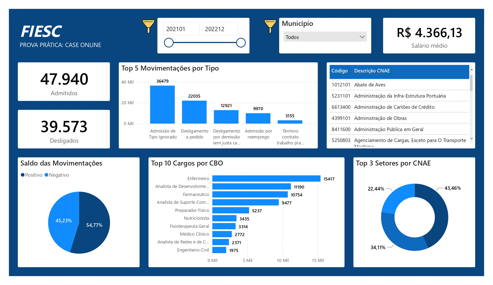

# 💼 Profissionais STEAM em Santa Catarina

Este repositório apresenta a resolução de um estudo de caso prático real, desenvolvido para o processo seletivo do **Observatório da FIESC (IEL)**. O projeto validou minhas competências analíticas e estratégicas, resultando na minha aprovação e contratação para a vaga. O objetivo foi utilizar microdados oficiais do Novo CAGED para investigar o mercado de trabalho de profissionais das áreas de **STEAM** (Ciência, Tecnologia, Engenharia e Matemática) no estado de Santa Catarina.

## 🎯 O Problema de Negócio & Desafio

O time do Observatório vinha recebendo relatos de empresários locais indicando sérias dificuldades em **contratar e reter** talentos técnicos e científicos. 

Minha atuação consistiu em agir como uma analista consultiva para:

1. **Formular e testar hipóteses** baseadas nos dados brutos de movimentação do CAGED para validar se as dores do mercado eram reais.
2. **Desenvolver indicadores de monitoramento** utilizando critérios de filtros específicos de CBO (Famílias 20, 21 e 22) para isolar o ecossistema STEAM.
3. **Construir uma solução visual (Dashboard)** voltada para o time técnico e tomadores de decisão justificarem suas ações estratégicas.

## 🖥️ Desenvolvimento do Racional Analítico (Python)

A análise exploratória e o tratamento de dados foram construídos em Python (`pandas`), seguindo os seguintes passos de execução:

- **Mapeamento e Saldo Geral:** Isolei a volumetria e identifiquei que o mercado expandia de forma líquida, registrando **54,77% de movimentações positivas** (admissões) contra **45,23% negativas** (desligamentos).
- **Análise de Demanda por Cargo:** Mapeei as 10 profissões com maior volume de registros. Enfermeiros, Analistas de Desenvolvimento de Sistemas e Farmacêuticos lideram o topo. Constatou-se também que funções de pesquisa pura (CBO iniciado em 20, como Bioengenheiros e Geneticistas) figuram entre as menores demandas.
- **Diagnóstico do Gargalo (Turnover):** Ao extrair os 5 maiores motivos de movimentação, descobri o principal insight do projeto: mais de **20 mil registros eram de desligamentos a pedido do próprio empregado**. 

## 📊 Dashboard Interativo (Power BI)

A partir da base tratada e enriquecida, desenvolvi um painel executivo para cruzamento de dados de mercado (dados de competências de 2021 e 2022).

### 🔗 Acesse o Painel Interativo

Como o GitHub não permite a inclusão de iframes diretos por segurança, você pode acessar e interagir com o painel online clicando no botão ou no link abaixo:

> [!TIP]
> **[Dashboard - Profissões STEAM](https://app.powerbi.com/view?r=eyJrIjoiMzQwZGU4OTItOGQwNC00MGRkLTkyMmMtOTliMWI4YWIzZWEyIiwidCI6ImEzZTU3Zjc1LTU5YTktNDFkOS05ZGIwLTA0YmM0ODg2YWY3NyJ9)**

### Recursos Implementados no Painel:

- **Filtros Avançados:** Segmentação dinâmica por municípios de Santa Catarina e evolução temporal mensal.
- **Visões de Negócio:** Gráficos de movimentação por tipo, rankings de cargos (CBO) e detalhamento dos setores industriais e comerciais dominantes via CNAE (utilizando gráfico de rosca para os top 3 setores).
- **Métricas em Cartões:** Exibição ágil de Salário Médio de contratação, Quantidade Total de Admitidos e Total de Desligados, que respondem dinamicamente aos filtros.

## 💡 Verificação de Resultados & Conclusões de Negócio

Os dados provaram que **a dor principal dos empresários não era a escassez de contratação, mas sim a deficiência em retenção (*turnover*).**

- **Por que é difícil reter?** A liderança massiva de rescisões por *desligamento voluntário* (iniciativa do trabalhador) indica que as empresas precisam revisar urgentemente suas políticas de clima organizacional, planos de carreira e benefícios para evitar a perda de talentos.
- **Por que é difícil contratar?** O desalinhamento pode estar na senioridade exigida versus o salário ofertado. A solução passa por reestruturar as descrições das vagas, adequando ferramentas técnicas e responsabilidades ao teto de remuneração de mercado praticado em Santa Catarina.

## 🛠️ Tecnologias Utilizadas

- **Python 3.11+** (`pandas`, `seaborn`, `matplotlib`)
- **Power BI Service** (Engenharia de Dashboards & Data Viz)
- **Excel** (Formato intermediário para ingestão do modelo de dados)

> [!IMPORTANT]
> *Projeto desenvolvido com sucesso por Andrea Sousa, aprovado pelo comitê técnico do Observatório FIESC.*

## 🚀 Ideias de Evolução (Indo Além do Case)

Como este projeto reflete um cenário real de mercado, planejo expandir o escopo original com as seguintes implementações:

- [ ] **Análise de Input de Talentos (Oferta vs. Demanda):** Integrar os dados do Censo da Educação Superior (INEP) para mapear o volume de formandos em cursos STEAM por região. O objetivo é contrastar a formação de novos entrantes com a taxa de abertura de vagas do CAGED, identificando se o gargalo do mercado é a escassez de formação ou a retenção salarial.
- [ ] **Machine Learning (Previsão de Salários):** Construir um modelo de regressão para prever o salário médio de admissão com base na região, porte da empresa (CNAE) e nível de senioridade do CBO.
- [ ] **Análise de Cohort para Turnover:** Estruturar uma análise temporal para medir o tempo médio de permanência do profissional STEAM em cada cadeira antes do desligamento.
- [ ] **Automação do Pipeline (ETL):** Migrar a leitura dos arquivos locais para um pipeline dinâmico que consome diretamente os dados mensais disponibilizados pelo FTP do Ministério do Trabalho e Emprego.

  
